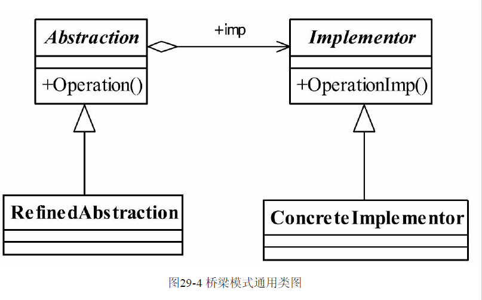

### 桥梁模式

● Abstraction——抽象化角色
它的主要职责是定义出该角色的行为，同时保存一个对实现化角色的引用，该角色一般
是抽象类。

● Implementor——实现化角色
它是接口或者抽象类，定义角色必需的行为和属性。

● RefinedAbstraction——修正抽象化角色
它引用实现化角色对抽象化角色进行修正。

● ConcreteImplementor——具体实现化角色
它实现接口或抽象类定义的方法和属性。

抽象角色引用实现角色，
或者说抽象角色的部分实现是由实现角色完成的

桥梁模式的使用场景

● 不希望或不适用使用继承的场景
例如继承层次过渡、无法更细化设计颗粒等场景，需要考虑使用桥梁模式。

● 接口或抽象类不稳定的场景
明知道接口不稳定还想通过实现或继承来实现业务需求，那是得不偿失的，也是比较失
败的做法。

● 重用性要求较高的场景
设计的颗粒度越细，则被重用的可能性就越大，而采用继承则受父类的限制，不可能出
现太细的颗粒度。