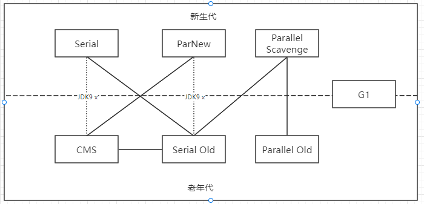

### 分代收集器组合

### Serial
串行垃圾收集器, 
- 新生代采用**标记-复制算法** >> 暂停用户线程（STW）
- 老年代采用**标记-整理算法** >> 暂停用户线程（STW）
##### 优点
- 额外内存占用小、简单以及高效
- client模式下默认新生代收集器

### ParNew
**新生代**收集器
多线程版本的串行收集器。

**标记-复制算法**

jdk9之后，**唯一**仅存能和CMS配合的新生代收集器。

### Parallel Scavenge
**新生代**收集器 -吞吐量优先收集器

目的：达到一个可控制的吞吐量（**吞吐量=运行用户代码时间 / (运行用户代码时间 + 运行垃圾收集时间)**）
> -XX：MaxGCPauseMillis  控制最大垃圾收集停顿时间  
> -XX：GCTimeRatio  直接设置吞吐量大小  
> -XX：+UseAdaptiveSizePolicy  垃圾收集的自适应的调节策略  

### Serial Old
**老年代**收集器  
**标记-整理算法**  
作为`CMS收集器`发生失败时的后备预案，在并发收集发生`Concurrent Mode Failure`时使用

### Parallel Old
**老年代**收集器  
**标记-整理算法**

吞吐量或者处理器资源较为稀缺，使用`Parallel Scavenge`加`Parallel Old` 组合

### CMS
**老年代**收集器
**标记-清除算法**
目标：最短回收停顿时间
##### 步骤：
1. 初始标记（CMS initial mark）(_STW_) 标记一下GC Roots能直接关联到的对象，速度很快
2. 并发标记（CMS concurrent mark） 从GC Roots的直接关联对象开始遍历整个对象图的过程，这个过程耗时较长但是不需要停顿用户线程，可以与垃圾收集线程一起并发运行
3. 重新标记（CMS remark）(_STW_) 修正并发标记期间，因用户程序继续运作而导致标记产生变动的那一部分对象的 标记记录
4. 并发清除（CMS concurrent sweep）清理删除掉标记阶段判断的已经死亡的对象

##### 缺点：
1. `资源敏感`。默认回收线程数= （`core cpu` + 3） / 4 ,所以，当 `core cpu`（核心cpu数）不足4个时，回收线程的开销很大。
2. 无法解决`浮动垃圾`，
> 并发标记和并发清理阶段，用户线程是还在继续运行的，程序在运行自然就还会伴随有新的垃圾对象不断产生，但这一部分垃圾对象是出现在标记过程结束以后，CMS无法在当次收集中处理掉它们，只好留待下一次垃圾收集时再清理掉  
> CMS运行期间预留的内存无法满足程序分配新对象的需要, 此时会发生`Concurrent Mode Failure` -> STW, 退化使用Serial Old重新收集 
3. 大量空间碎片
> +UseCMS-CompactAtFullCollection  （jdk9 之后废弃）
> 在CMS收集器不得不进行Full GC时开启内存碎片的合并整理过程，由于这个内存整理必须移动存活对象，是无法并发的。  
> -XX：CMSFullGCsBefore- Compaction （jdk9 之后废弃）
> 是要求CMS收集器在执行过若干次（数量 由参数值决定）不整理空间的Full GC之后，下一次进入Full GC前会先进行碎片整理

### G1

> 局部收集  
> 在延迟可控的情况下获得尽可能高的吞吐量

##### 基于region的内存布局
E-新生代   
S-幸存者  
O-老年代   
H-大对象（超过了一个Region容量一半的对象即可判定为大对象。）

> -XX：G1HeapRegionSize 设置一块区域的大小

##### 停顿时间模型 
> 能够支持指定在一个长度为M毫秒的时间片段内，消耗在垃圾收集上的时间大概率不超过N毫秒这样的目标

它将Region作为单次回收的最小单元，即每次收集到的内存空间都是Region大小的整数倍，这样可以有计划地避免在整个Java堆中进行全区域的垃圾收集。

更具体的处理思路是让G1收集器去跟踪各个Region里面的垃圾堆积的“价值”大小（价值即回收所获得的空间大小以及回收所需时间的经验值）。

然后在后台维护一个优先级列表，每次根据用户设定允许的收集停顿时间（使用参数`-XX：MaxGCPauseMillis`指定，默 认值是200毫秒），优先处理回收价值收益最大的那些Region

##### Mixed GC模式

> 衡量标准不再是它属于哪个分代，而是哪块内存中存放的垃圾数量最多，回收收益最大  

#### 大致收集步骤
- 初始标记（Initial Marking）：_STW_ 仅仅只是标记一下GC Roots能直接关联到的对象，并且**修改TAMS指针**的值，让下一阶段用户线程并发运行时，能正确地在可用的Region中分配新对象。 
- 并发标记（Concurrent Marking）：从GC Root开始对堆中对象进行可达性分析，递归扫描整个堆里的对象图，找出要回收的对象，这阶段耗时较长，但可与用户程序并发执行。当对象图扫描完成以后，还要重新处理SATB（原始快照）记录下的在并发时有引用变动的对象。 
- 最终标记（Final Marking）：_STW_ 处理并发阶段结束后仍遗留下来的最后那少量的SATB记录。 
- 筛选回收（Live Data Counting and Evacuation）：_STW_ 负责更新Region的统计数据，对各个Region的回收价值和成本进行排序，根据用户所期望的停顿时间来制定回收计划，可以自由选择任意多个Region构成回收集，然后把决定回收的那一部分Region的存活对象复制到空的Region中，再清理掉整个旧Region的全部空间。这里的操作涉及存活对象的移动，是必须暂停用户线程，由多条收集器线程并行完成的。

#### 问题
##### Region里面存在的跨Region引用对象如何解决
**记忆集**
> 每个Region都维护有自己的记忆集，这些记忆集会记录下别的Region 指向自己的指针，并标记这些指针分别在哪些卡页的范围之内。
> 哈希表: Key是别的Region的起始地址，Value是一个集合，里面存储的元素是卡表的索引号  
> 耗费Java堆容量10%至20%的额外内存
##### 在并发标记阶段如何保证收集线程与用户线程互不干扰地运行
**原始快照（SATB）**
> 在回收过程中新创建对象的内存分配上，程序要继续运行就肯定会持续有新对象被创建，G1为每一个Region设计了两个名为TAMS（Top at Mark Start）的指针，把Region中的一部分空间划分出来用于并发回收过程中的新对象分配，并发回收时新分配的对象地址都必须要在这两个指针位置以上。    
> G1收集器默认在这个地址以上的对象是被隐式标记过的，即默认它们是存活的，不纳入回收范围。  
> 与CMS中 的“Concurrent Mode Failure”失败会导致Full GC类似，如果内存回收的速度赶不上内存分配的速度，G1收集器也要被迫冻结用户线程执行，导致Full GC而产生长时间“Stop The World”。  
##### 怎样建立起可靠的停顿预测模型
**衰减均值**
> G1收集器会记录每个Region的回收耗时、每个Region记忆集里的脏卡数量等各个可测量的步骤花费的成本，并分析得出平均值、标准偏差、置信度等统计信息  
> Region的统计状态越新越能决定其回收的价值

#### 优点：
可以由用户指定期望的停顿时间是G1收集器很强大的一个功能，设置不同的期望停顿 时间，可使得G1在不同应用场景中取得关注吞吐量和关注延迟之间的最佳平衡
期望停顿时间设置为一两百毫秒或者两三百毫秒

G1运作期间不会产生内存空间碎片，垃圾收集完成之后能提供规整的可用内存
#### 缺点：

**内存占用**  
G1的记忆集（和其他内存消耗）可能会占整个堆容量的20%乃至更多的内存空间

**执行负载**  
CMS用写后屏障来更新维护卡表；而G1除了使用写后屏障来进行同样的（由于G1的卡表结构复杂，其实是更烦琐的）卡表维护操作外，  
为了实现原始快照搜索（SATB）算法，还需要使用`写前屏障`来跟踪`并发时的指针变化情况`  
CMS同步实现写后屏障，G1就不得不将其实现`类似于消息队列的结构`把写前屏障和写后屏障中要做的事情都放到队列里，然后再异步处理