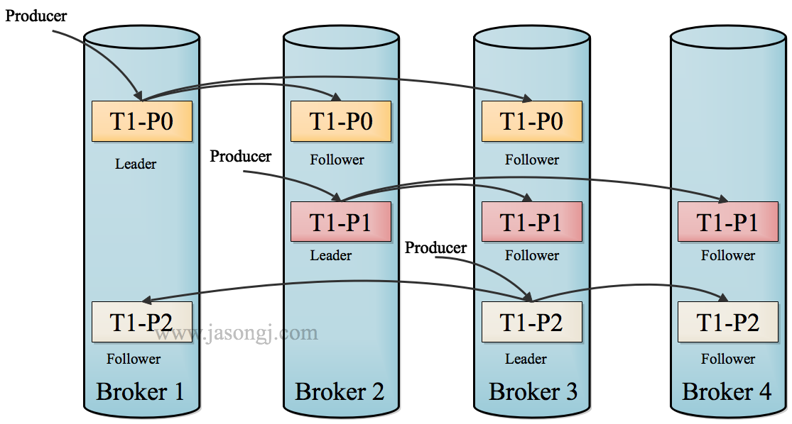

# kafka 文档笔记

### 一、kafka 基本概念

#### Topics和日志

Topic 就是数据主题，是数据记录发布的地方,可以用来区分业务系统。Kafka中的Topics总是多订阅者模式，一个topic可以拥有一个或者多个消费者来订阅它的数据。

对于每一个topic， Kafka集群都会维持一个分区日志

每个分区都是**有序且顺序不可变的记录集**，并且不断地追加到**结构化的commit log文件**。分区中的每一个记录都会分配一个id号来表示顺序，我们称之为offset，*offset*用来唯一的标识分区中每一条记录。

Kafka 集群保留所有发布的记录—无论他们是否已被消费—并通过一个可配置的参数——**保留期限**来控制. 


在每一个消费者中唯一保存的元数据是offset（偏移量）即消费在log中的位置。偏移量由消费者所控制：通常在读取记录后，消费者会以线性的方式增加偏移量，但是实际上，由于这个位置由消费者控制，所以消费者可以采用任何顺序来消费记录。


日志的分区partition （分布）在Kafka集群的服务器上。每个服务器在处理数据和请求时，共享这些分区。每一个分区都会在已配置的服务器上进行备份，确保容错性.

每个分区都有一台 server 作为 “leader”，零台或者多台server作为 follwers 。leader server 处理一切对 partition （分区）的读写请求，而follwers只需被动的同步leader上的数据。


### 二、kafka 设计思想

#### 持久化相关

> kafka对消息的存储和缓存严重依赖于文件系统。而文件系统存储在系统磁盘上

###### 磁盘上文件系统数据读取的速度保证

1. 现代操作系统提供的 read-ahead 和 write-behind 技术。read-ahead 是以大的 data block 为单位预先读取数据，而 write-behind 是将多个小型的逻辑写合并成一次大型的物理磁盘写入。从而让数据在磁盘上的存放地址变为有序。

2. [ ACM Queue article](http://queue.acm.org/detail.cfm?id=1563874) 操作系统中顺序访问速度对比。实际上**顺序磁盘访问在某些情况下比随机内存访问还要快**。

   

3. 现代操作系统在越来越注重使用内存对磁盘进行 cache。主动将所有空闲内存用作 disk caching，代价是在内存回收时性能会有所降低。所有对磁盘的读写操作都会通过这个统一的 cache。

#### 性能相关

> 问题 >>> 大量的小型 I/O 操作，以及过多的字节拷贝。(磁盘访问速度问题以得到保障)

###### 大量的小型 I/O 操作

为了避免这种情况，我们的协议是建立在一个 “消息块” 的抽象基础上，合理将消息分组。 使网络请求将多个消息打包成一组，而不是每次发送一条消息，从而使**整组消息**分担网络中往返的开销

###### 低效率的字节拷贝操作

1. 使 producer ，broker 和 consumer 都共享的标准化的二进制消息格式，这样数据块不用修改就能在他们之间传递。
2. 现代的unix 操作系统提供了一个高度优化的编码方式----[ sendfile ](http://man7.org/linux/man-pages/man2/sendfile.2.html)，用于将数据从 pagecache 转移到 socket 网络连接中（网络接口控制器NIC）。

#### 生产者相关

###### 负载均衡（Load balancing）

​	生产者直接发送数据到主分区的服务器上，不需要经过任何中间路由。 为了让生产者实现这个功能，所有的 kafka 服务器节点都能响应这样的元数据请求： 哪些服务器是活着的，主题的哪些分区是主分区，分配在哪个服务器上，这样生产者就能适当地直接发送它的请求到服务器上。

###### 生产者负责将记录分配到topic的哪一个 partition（分区）中

#### 消费者相关

###### push OR pull

​	producer 把数据 push 到 broker，然后 consumer 从 broker 中 pull 数据

push-base 系统的优点：

1. 当 consumer 速率落后于 producer 时，可以在适当的时间赶上来

2. 可以大批量生产要发送给 consumer 的数据

   缺点：

1. 如果 broker 中没有数据，consumer 可能会在一个紧密的循环中结束轮询，实际上 busy-waiting 直到数据到来

> 为了避免 busy-waiting，我们在 pull 请求中加入参数，使得 consumer 在一个“long pull”中阻塞等待，直到数据到来（还可以选择等待给定字节长度的数据来确保传输长度）。


###### offet

大多数消息系统都在 broker 上保存被消费消息的元数据。

Kafka的 topic 被分割成了一组完全有序的 partition，其中每一个 partition 在任意给定的时间内只能被每个订阅了这个 topic 的 consumer 组中的一个 consumer 消费。这意味着 partition 中 每一个 consumer 的位置仅仅是一个数字，即下一条要消费的消息的offset。这使得被消费的消息的状态信息相当少，每个 partition 只需要一个数字。这个状态信息还可以作为周期性的 checkpoint。这以非常低的代价实现了和消息确认机制等同的效果。

consumer 可以*回退*到之前的 offset 来再次消费之前的数据，这个操作违反了队列的基本原则，但事实证明对大多数 consumer 来说这是一个必不可少的特性。


#### 消息交付（Exactly Once语义与事务机制原理）

##### 发布消息的持久性保证

Kafka producer新增了幂等性的传递选项，该选项保证重传不会在 log 中产生重复条目。 为实现这个目的, broker 给每个 producer 都分配了一个 ID ，并且 producer 给每条被发送的消息分配了一个序列号来避免产生重复的消息。

producer 新增了使用类似事务性的语义将消息发送到多个 topic partition 的功能： 也就是说，要么所有的消息都被成功的写入到了 log，要么一个都没写进去。

##### 消费消息的保证

// todo


#### KAFKA HA(High Available)

>HW（High Watermark）：俗称高水位，它标识了一个特定的消息偏移量（offset），消费者只能**拉取到这个 offset 之前的消息。分区 ISR 集合中的每个副本都会维护自身的 LEO（Log End Offset）：俗称日志末端位移，而 ISR 集合中最小的 LEO 即为分区的 HW，对消费者而言只能消费 HW 之前的消息。
>LEO：该副本底层 log文件下一条要写入的消息的位移，例如 LEO=10 则当前文件已经写了10条消息，位移是[0,10)。
>HW：所有分区已提交的的位移，一般HW<=LEO。

##### HA下的消息投递

​	Producer在发布消息到某个Partition时，先通过 Metadata （通过 Broker 获取并且缓存在 Producer 内） 找到该 Partition 的**Leader**，然后无论该Topic的Replication Factor为多少（也即该Partition有多少个Replica），Producer**只将该消息发送到该Partition的Leader**。Leader会将该消息写入其本地Log。**每个Follower都从Leader pull数据**。这种方式上，Follower存储的数据顺序与Leader保持一致。Follower在收到该消息并写入其Log后，向Leader**发送ACK**。一旦**Leader收到了ISR中的所有Replica的ACK**，该消息就被认为已经**commit**了，Leader将增加HW并且向Producer发送ACK。
为了提高性能，每个Follower在接收到数据后就立马向Leader发送ACK，而非等到数据写入Log中。因此，对于已经commit的消息，Kafka只能保证它被存于多个Replica的内存中，而不能保证它们被持久化到磁盘中，也就不能完全保证异常发生后该条消息一定能被Consumer消费。但考虑到这种场景非常少见，可以认为这种方式在性能和数据持久化上做了一个比较好的平衡。在将来的版本中，Kafka会考虑提供更高的持久性。
Consumer读消息也是从Leader读取，只有被commit过的消息（offset低于HW的消息）才会暴露给Consumer。

ps: ISR(In-sync-replica，同步副本集。replica.lag.time.max.ms。follower从leader副本拉取消息，如果持续拉取速度慢于leader副本写入速度，慢于时间超过replica.lag.time.max.ms后，它就变成“非同步”副本，就会被踢出ISR副本集合中。但后面如何follower副本的速度慢慢提上来，那就又可能会重新加入ISR副本集合中了) 



##### HA下的broker


##### HA下的消息消费


#### 按键保存策略

​		按键保存策略，就是当生产者发送数据的时候，可以指定一个key，计算这个key的hashCode值，按照hashCode的值对不同消息进行存储。

至于要如何实现，那也简单，只要让生产者发送的时候指定key就行。

可以查看下kafka源码 发送分区指定这块的逻辑

KafkaProducer#doSend(ProducerRecord<K, V> record, Callback callback)

```java
	/**
     * computes partition for given record.
     * if the record has partition returns the value otherwise
     * calls configured partitioner class to compute the partition.
     */
    private int partition(ProducerRecord<K, V> record, byte[] serializedKey, byte[] serializedValue, Cluster cluster) {
        Integer partition = record.partition();
        //不指定partition字段则根据key的hashCode值来确认使用哪个分区
        return partition != null ?
                partition :
                partitioner.partition(
                        record.topic(), record.key(), serializedKey, record.value(), serializedValue, cluster);
    } 

    /**
     * Compute the partition for the given record.
     * 根据给的消息记录计算分区位置
     *
     * @param topic The topic name
     * @param key The key to partition on (or null if no key)
     * @param keyBytes serialized key to partition on (or null if no key)
     * @param value The value to partition on or null
     * @param valueBytes serialized value to partition on or null
     * @param cluster The current cluster metadata
     */
    public int partition(String topic, Object key, byte[] keyBytes, Object value, byte[] valueBytes, Cluster cluster) {
        if (keyBytes == null) {
            return stickyPartitionCache.partition(topic, cluster);
        } 
        List<PartitionInfo> partitions = cluster.partitionsForTopic(topic);
        int numPartitions = partitions.size();
        //对key进行hash 来确定应该放到哪个分区
        // hash the keyBytes to choose a partition
        return Utils.toPositive(Utils.murmur2(keyBytes)) % numPartitions;
    }
```

#### producer的acks参数

前面说了那么多理论的知识，那么就可以来看看如何在实际应用中使用这些知识。

跟副本关系最大的，那自然就是acks机制，acks决定了生产者如何在性能与数据可靠之间做取舍。

配置acks的代码其实很简单，只需要在新建producer的时候多加一个配置：

```java
    val properties = new Properties()
	......
	props.put("acks", "0/1/-1");  //配置acks，有三个可选值
	......其他配置
	val producer = new KafkaProducer[String, String](properties)
```

acks这个配置可以指定三个值，分别是0，1和-1。我们分别来说三者代表什么：

- acks为0：这意味着producer发送数据后，不会等待broker确认，直接发送下一条数据，性能最快
- acks为1：为1意味着producer发送数据后，需要等待leader副本确认接收后，才会发送下一条数据，性能中等
- acks为-1：这个代表的是all，意味着发送的消息写入所有的ISR集合中的副本（注意不是全部副本）后，才会发送下一条数据，性能最慢，但可靠性最强


