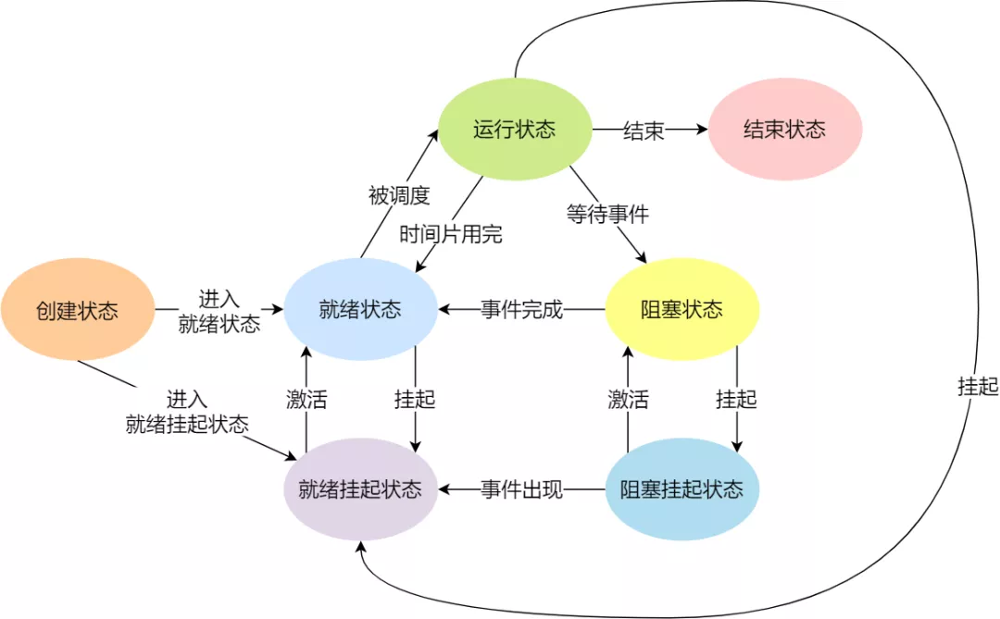

### 进程
#### 概念
> 进程是程序的一次执行，是系统进行`资源分配和调度`的独立单位，他的作用是是程序能够并发执行提高资源利用率和吞吐率。
> 由于进程是资源分配和调度的基本单位，因为进程的创建、销毁、切换产生大量的时间和空间的开销，所以进程的数量不能太多。
#### 状态

- 创建状态（new）：进程正在被创建时的状态；
- 运行状态（Runing）：该时刻进程占用 CPU；
- 就绪状态（Ready）：可运行，但因为其他进程正在运行而暂停停止；
- 阻塞状态（Blocked）：该进程正在等待某一事件发生（如等待输入/输出操作的完成）而暂时停止运行，这时，即使给它CPU控制权，它也无法运行；
- 结束状态（Exit）：进程正在从系统中消失时的状态；
- 挂起状态：表示进程没有占有内存空间。这跟阻塞状态是不一样，阻塞状态是等待某个事件的返回。由于虚拟内存管理原因，进程的所使用的空间可能并没有映射到物理内存，而是在硬盘上，这时进程就会出现挂起状态。

挂起状态可以分为两种：

- 阻塞挂起状态：进程在外存（硬盘）并等待某个事件的出现；
- 就绪挂起状态：进程在外存（硬盘），但只要进入内存，即刻立刻运行；

状态变迁图：  

#### 进程的控制结构
PCB 进程控制块

##### 进程描述信息：

进程标识符：标识各个进程，每个进程都有一个并且唯一的标识符；

用户标识符：进程归属的用户，用户标识符主要为共享和保护服务；

##### 进程控制和管理信息：

进程当前状态，如 new、ready、running、waiting 或 blocked 等；

进程优先级：进程抢占 CPU 时的优先级；

##### 资源分配清单：

有关内存地址空间或虚拟地址空间的信息，所打开文件的列表和所使用的 I/O 设备信息。

##### CPU 相关信息：

CPU 中各个寄存器的值，当进程被切换时，CPU 的状态信息都会被保存在相应的 PCB 中，以便进程重新执行时，能从断点处继续执行。

#### 进程的上下文切换

各个进程之间是共享 CPU 资源的，在不同的时候进程之间需要切换，让不同的进程可以在 CPU 执行，那么这个一个进程切换到另一个进程运行，称为进程的上下文切换。

进程的上下文切换不仅包含了虚拟内存、栈、全局变量等用户空间的资源，还包括了内核堆栈、寄存器等内核空间的资源。  
通常，会把交换的信息保存在进程的 PCB，当要运行另外一个进程的时候，我们需要从这个进程的 PCB 取出上下文，然后恢复到 CPU 中，这使得这个进程可以继续执行  
如图：  

#### 进程上下文切换场景

- 为了保证所有进程可以得到公平调度，CPU 时间被划分为一段段的时间片，这些时间片再被轮流分配给各个进程。这样，当某个进程的时间片耗尽了，就会被系统挂起，切换到其它正在等待 CPU 的进程运行；

- 进程在系统资源不足（比如内存不足）时，要等到资源满足后才可以运行，这个时候进程也会被挂起，并由系统调度其他进程运行；

- 当进程通过睡眠函数 sleep 这样的方法将自己主动挂起时，自然也会重新调度；

- 当有优先级更高的进程运行时，为了保证高优先级进程的运行，当前进程会被挂起，由高优先级进程来运行；

- 发生硬件中断时，CPU 上的进程会被中断挂起，转而执行内核中的中断服务程序；

### 线程
#### 概念
线程是 `CPU调度`的基本单位

#### java中线程的状态
- 初始(NEW)：新创建了一个线程对象，但还没有调用start()方法。
- 运行(RUNNABLE)：
> Java线程中将就绪（ready）和运行中（running）两种状态笼统的称为“运行”。
> 线程对象创建后，其他线程(比如main线程）调用了该对象的start()方法。
> 该状态的线程位于可运行线程池中，等待被线程调度选中，获取CPU的使用权，此时处于就绪状态（ready）。
> 就绪状态的线程在获得CPU时间片后变为运行中状态（running）
- 阻塞(BLOCKED)：表示线程阻塞于锁。
- 等待(WAITING)：进入该状态的线程需要等待其他线程做出一些特定动作（通知或中断）。
- 超时等待(TIMED_WAITING)：该状态不同于WAITING，它可以在指定的时间后自行返回。
- 终止(TERMINATED)：表示该线程已经执行完毕。

#### 线程的实现

- 用户线程（User Thread）：在用户空间实现的线程，不是由内核管理的线程，是由用户态的线程库来完成线程的管理；
> 用户线程的整个线程管理和调度，操作系统是不直接参与的，而是由用户级线程库函数来完成线程的管理，包括线程的创建、终止、同步和调度等。
- 内核线程（Kernel Thread）：在内核中实现的线程，是由内核管理的线程；
> 内核线程是由操作系统管理的，线程对应的 TCB 自然是放在操作系统里的，这样线程的创建、终止和管理都是由操作系统负责。
- 轻量级进程（LightWeight Process）：在内核中来支持用户线程；
> 轻量级进程（Light-weight process，LWP）是内核支持的用户线程，一个进程可有一个或多个 LWP，每个 LWP 是跟内核线程一对一映射的，也就是 LWP 都是由一个内核线程支持

#### 线程上下文切换的是什么？

这还得看线程是不是属于同一个进程：

- 当两个线程不是属于同一个进程，则切换的过程就跟进程上下文切换一样；

- 当两个线程是属于同一个进程，因为虚拟内存是共享的，所以在切换时，虚拟内存这些资源就保持不动，只需要切换线程的私有数据、寄存器等不共享的数据；

### 线程与进程的比较
#### 线程与进程的比较如下：

- 进程是资源（包括内存、打开的文件等）分配的单位，线程是 CPU 调度的单位；

- 进程拥有一个完整的资源平台，而线程只独享必不可少的资源，如寄存器和栈；

- 线程同样具有就绪、阻塞、执行三种基本状态，同样具有状态之间的转换关系；

#### 线程能减少并发执行的时间和空间开销；

对于，线程相比进程能减少开销，体现在：

- 线程的创建时间比进程快，因为进程在创建的过程中，还需要资源管理信息，比如内存管理信息、文件管理信息，而线程在创建的过程中，不会涉及这些资源管理信息，而是共享它们；

- 线程的终止时间比进程快，因为线程释放的资源相比进程少很多；

- 同一个进程内的线程切换比进程切换快，因为线程具有相同的地址空间（虚拟内存共享），这意味着同一个进程的线程都具有同一个页表，那么在切换的时候不需要切换页表。而对于进程之间的切换，切换的时候要把页表给切换掉，而页表的切换过程开销是比较大的；

- 由于同一进程的各线程间共享内存和文件资源，那么在线程之间数据传递的时候，就不需要经过内核了，这就使得线程之间的数据交互效率更高了；

所以，线程比进程不管是时间效率，还是空间效率都要高。

### 进程调度

- 先来先服务调度算法
- 最短作业优先调度算法
- 高响应比优先调度算法 （权衡长任务和短任务）
> 优先级 = （等待时间 + 要求服务时间）/ 要求服务时间
- 时间片轮转调度算法
> 每个进程被分配一个时间段，称为时间片（Quantum），即允许该进程在该时间段中运行。
> 如果时间片用完，进程还在运行，那么将会把此进程从 CPU 释放出来，并把 CPU 分配另外一个进程；
> 如果该进程在时间片结束前阻塞或结束，则 CPU 立即进行切换；
- 最高优先级调度算法
- 多级反馈队列调度算法
> 是「时间片轮转算法」和「最高优先级算法」的综合和发展。比较综合

多级反馈队列调度算法--整体流程：
- 设置了多个队列，赋予每个队列不同的优先级，每个队列优先级从高到低，同时优先级越高时间片越短；

- 新的进程会被放入到第一级队列的末尾，按先来先服务的原则排队等待被调度，如果在第一级队列规定的时间片没运行完成，则将其转入到第二级队列的末尾，以此类推，直至完成；

- 当较高优先级的队列为空，才调度较低优先级的队列中的进程运行。如果进程运行时，有新进程进入较高优先级的队列，则停止当前运行的进程并将其移入到原队列末尾，接着让较高优先级的进程运行；

流程如图：

